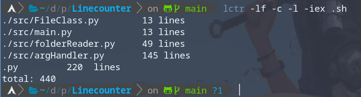
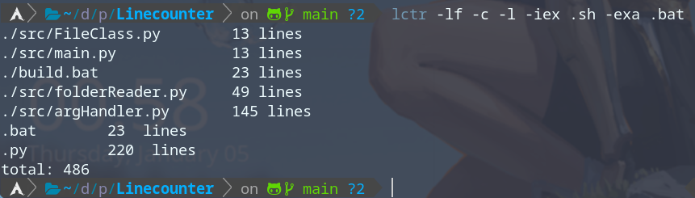

# Linecounter

Linecounter is a simple python program to count your lines of your source code in your project

## Description

Linecounter is a small python program that helps you count the amount of lines in your source code (it works on any files) 
 
 <a href="https://github.com/spynetS/Linecounter/blob/main/images/show1.png">
    
  </a>


## Getting Started

### Dependencies
* Python3 (inlcuding pip)
* Windows, Linux, Mac

### Installing
* Linux

You can download it with yay from aur

```yay -S linecounter-git```

https://aur.archlinux.org/packages/linecounter-git

[Download](https://github.com/spynetS/Linecounter.git) the src code and and run the build.bash file
This will create the binary and place it in the /usr/bin folder and set the environment variable
so you only need to write lctr in your terminal

* Windows
[Download](https://github.com/spynetS/Linecounter.git) the src code and and run the build.bat file
This will create the binary and place it in the C:/User/user/Linecounter folder and create a environment varable (Linecounter)
that you have to copy the value and and adding it to the path varable

### Executing program

Program starts by ignoring theise folders ```['./.git', './src/__pycache__']```
The default extentions counting are ```['.py', '.c', '.java', '.cpp', '.sh', '.js', '.jsx', '.css', '.html']```

* List all files with their linecounts in all files and subfolders
```
lctr
```
* Help
```
lctr -
```

## Examples
<a href="https://github.com/spynetS/Linecounter/blob/main/images">
    
    
    
    
 </a>
 


## Authors

Contributors names and contact info

* [spynetS](https://github.com/spynetS)


## License

This project is licensed under the [MIT] License - see the LICENSE.md file for details


