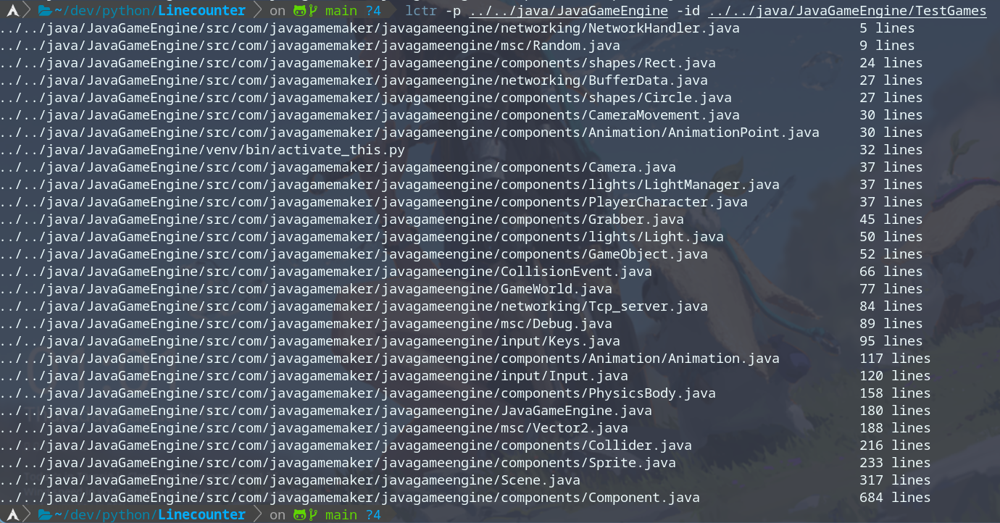

# Linecounter

Linecounter is a simple python program to count your lines of your source code in your project

## Description

Linecounter is a small python program that helps you count the amount of lines in your source code (it works on any files) 
 <a href="https://github.com/othneildrew/Best-README-Template">
    
  </a>
</div>


## Getting Started

### Dependencies
* Python3 (inlcuding pip)
* Windows, Linux, Mac

### Installing
* Linux
[Download](https://github.com/spynetS/Linecounter.git) the src code and and run the build.bash file
This will create the binary and place it in the /usr/bin folder and set the environment variable
so you only need to write Linecounter in your terminal

* Windows
[Download](https://github.com/spynetS/Linecounter.git) the src code and and run the build.bat file
This will create the binary and place it in the C:/User/user/Linecounter folder and create a environment varable (Linecounter)
that you have to copy the value and and adding it to the path varable

### Executing program

* List the total lines in all files and subfolders
```
Linecounter -l
```
* List the total lines in all files and subfolders with curtain file extensions
```
Linecounter -l -su .py .txt
```
* List all files with their linecounts in all files and subfolders
```
Linecounter -lf
```
* List all files with their linecounts in all files and subfolders with curtain file extensions
```
Linecounter -lf -su .py .txt
```
* Set starting folder 
```
Linecounter -lf -p ../src -su .py .txt
```

## Help


## Authors

Contributors names and contact info

* [spynetsS](https://github.com/spynetS)
  
## Version History


* 0.1
    * Initial Release

## License

This project is licensed under the [MIT] License - see the LICENSE.md file for details

## Acknowledgments

